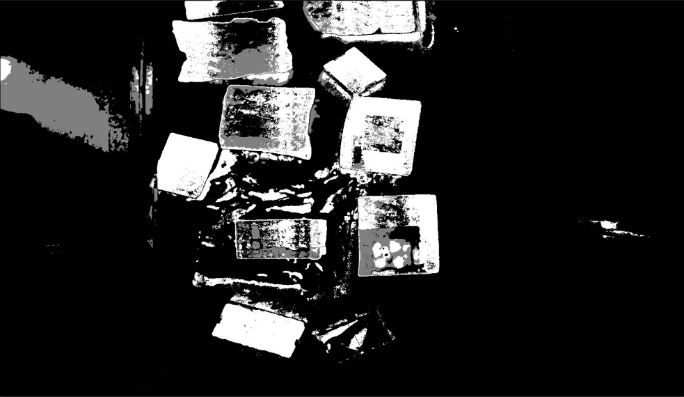
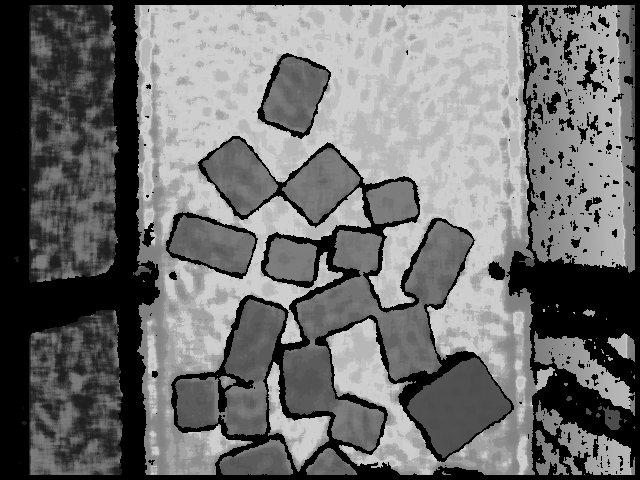

# Logistics package separation software

@ Software Copyright


## File structures

```
.
├── CMakeFiles
│   ├── CMakeDirectoryInformation.cmake
│   ├── main.dir
│   └── progress.marks
├── cmake_install.cmake
├── CMakeLists.txt
├── main.cpp
├── mainwindow.cpp
├── mainwindow.h
├── mainwindow.ui
├── Makefile
├── PackDetect
│   ├── CMakeLists.txt
│   ├── include
│   ├── PackDetection.cpp
│   └── PackSegment.cpp
├── PaddleInf
│   ├── CMakeLists.txt
│   ├── include
│   ├── model.pdiparams
│   ├── model.pdmodel
│   ├── PaddleInf.cpp
│   ├── paddle_inference
│   └── test.cpp
├── ParallelProcess
│   ├── CMakeLists.txt
│   ├── include
│   └── ParallelProcess.cpp
├── Parameter
│   ├── CMakeLists.txt
│   ├── include
│   └── Parameter.cpp
├── Tracker
│   ├── CMakeLists.txt
│   ├── include
│   ├── KFPredict.cpp
│   └── Tracker.cpp
└── TYConfigure
    ├── CMakeLists.txt
    ├── include
    └── TYConfigure.cpp
```


## Dependencies

- OpenCV4.5
- Percipio SDK
- PaddleInference
- QT5
- C++ Standard 17


## Procedures
1. Initialization
2. Load the image and perform image segmentation
3. The packages are detected with a segmented mask
4. Always pick the first one and track it


## Result


Segmentation result:




Wrap depth images captured using industrial 3D cameras:

